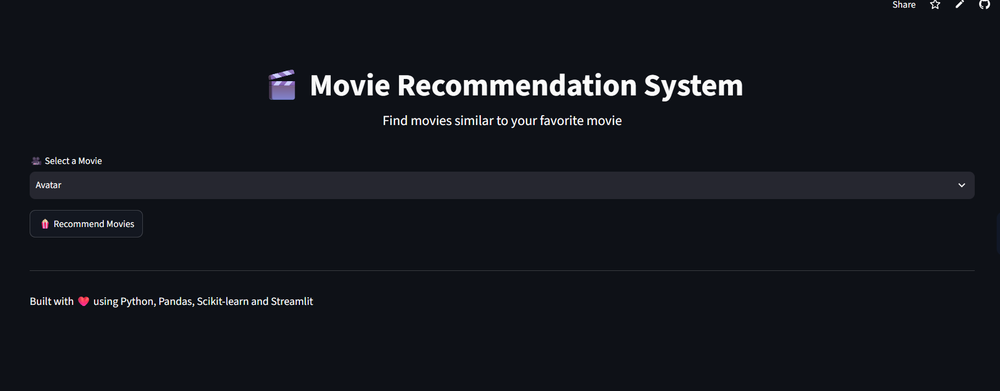

# 🎬 Movie Recommendation System

A simple movie recommendation system built with Python, Pandas, Scikit-learn and Streamlit.

The system recommends the top 5 movies similar to a selected movie using **TF-IDF Vectorization** and **Cosine Similarity**.

# 🎬 Movie Recommendation System

[🚀 Live Demo](https://movie-recommendation-system-as.streamlit.app/)

## 📸 Application Screenshot



## 🚀 Features

* Select a movie from the movie database
* Recommend the top 5 similar movies
* Uses movie genres and descriptions
* TF-IDF text vectorization
* Cosine similarity for finding similar movies
* Interactive Streamlit web interface
* Displays movie genre and description
* Handles movie recommendations automatically

## 🛠️ Technologies Used

* Python
* Pandas
* Scikit-learn
* Streamlit
* TF-IDF Vectorizer
* Cosine Similarity

## 📁 Project Structure

```text
Movie-Recommendation-System/
│
├── data/
│   └── movies.csv
│
├── app.py
├── movie_recommender.py
├── train_model.py
├── requirements.txt
├── README.md
└── .gitignore
```

## ⚙️ Installation

### 1. Clone the repository

```bash
git clone YOUR_GITHUB_REPOSITORY_URL
```

### 2. Open the project

```bash
cd Movie-Recommendation-System
```

### 3. Create a virtual environment

```bash
python -m venv venv
```

### 4. Activate the virtual environment

Windows:

```bash
venv\Scripts\activate
```

### 5. Install dependencies

```bash
pip install -r requirements.txt
```

## ▶️ Run the Application

Run the Streamlit application:

```bash
streamlit run app.py
```

The application will open in your browser.

Usually:

```text
http://localhost:8501
```

## 🧠 How It Works

The system combines the movie's:

* Genre
* Description

into a single text feature.

TF-IDF converts this text into numerical vectors.

Cosine Similarity then calculates how similar the movies are to each other.

When a user selects a movie, the system:

```text
User selects movie
        ↓
Find selected movie
        ↓
Compare with other movies
        ↓
Calculate similarity
        ↓
Sort similarity scores
        ↓
Select top 5
        ↓
Display recommendations
```

## 📊 Recommendation Method

### TF-IDF

TF-IDF stands for **Term Frequency-Inverse Document Frequency**.

It converts text into numerical values based on the importance of words.

### Cosine Similarity

Cosine similarity measures the similarity between two movie feature vectors.

A higher similarity score means the movies have more similar characteristics.

## 🎯 Example

If the user selects:

```text
Avatar
```

the system returns five movies that have similar genres and descriptions.

## 🔮 Future Improvements

* Add movie posters
* Use a larger movie dataset
* Add movie ratings
* Add release year
* Add cast and director information
* Add genre filtering
* Deploy the application online
* Add user-based recommendations
* Improve recommendation accuracy

## 👨‍💻 Author

Sahil Kumar

## 📜 License

This project is created for educational and internship purposes.
